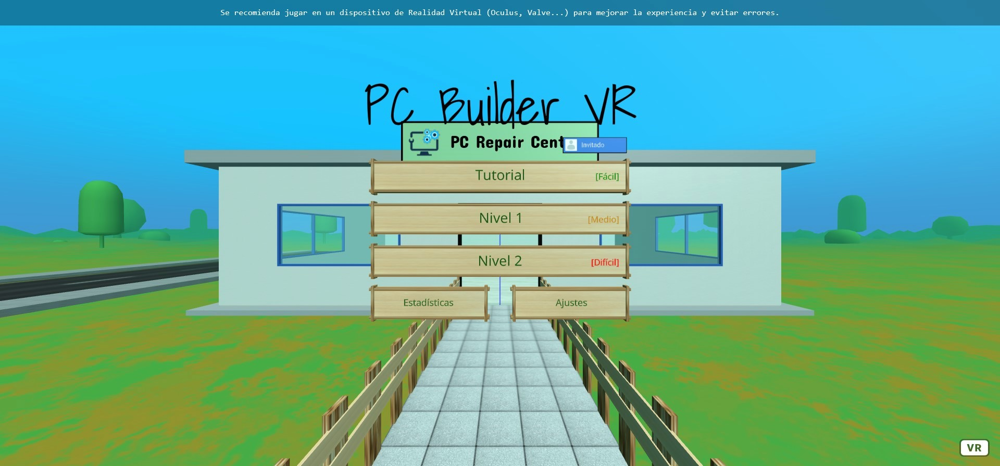

# PC Builder VR
### Desarrollador: Carlos Veny Carmona
Trabajo de Fin de Grado realizado para la Universitat de les Illes Balears y con el soporte del departamento de LTIM.  
Este repositorio contiene todo el código fuente del juego exceptuando aquellas partes del código incluidas de otras fuentes o repositorios de GitHub. Tampoco se incluye información sensible (usuarios y contraseñas).

## Juego
Es necesario jugar con un dispositivo de Realidad Virtual que tenga 6DoF (grados de libertad). Se puede hacer uso del teclado y ratón pero la experiencia se verá afectada y pueden aparecer algunos errores.  
También se puede jugar en el navegador integrado de ciertos dispositivos de Realidad Virtual, como el Oculus Browser, aunque el rendimiento puede ser ligeramente inferior.  
**Link:** https://alumnes-ltim.uib.es/pcbuilding/  

## Información extra
El juego usa el framework [A-Frame](https://aframe.io/) y ha sido desarrollado sobre entornos web por lo que se ha usado HTML, CSS y JavaScript para el front-end.  
En el caso del back-end se ha usado PHP para comunicarse con la Base de Datos de MySQL.  
También se han usado librerias auxiliares como JQuery o Bootstrap para facilitar la tarea de programación.
